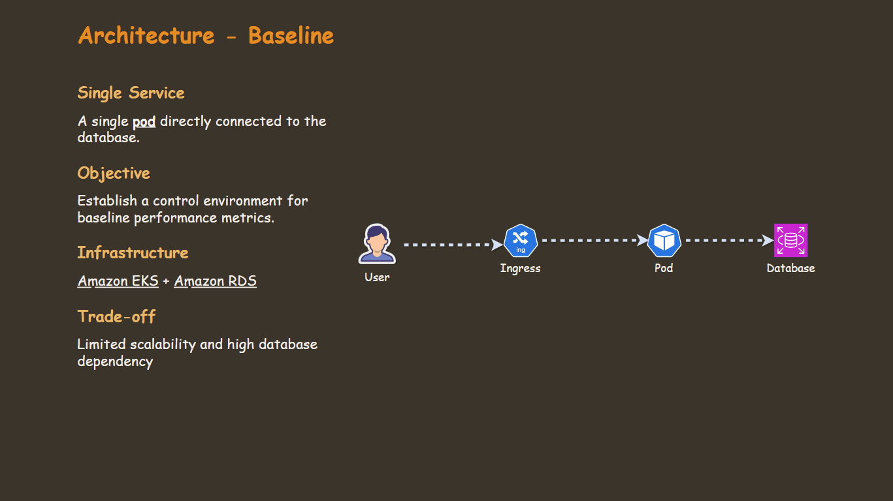
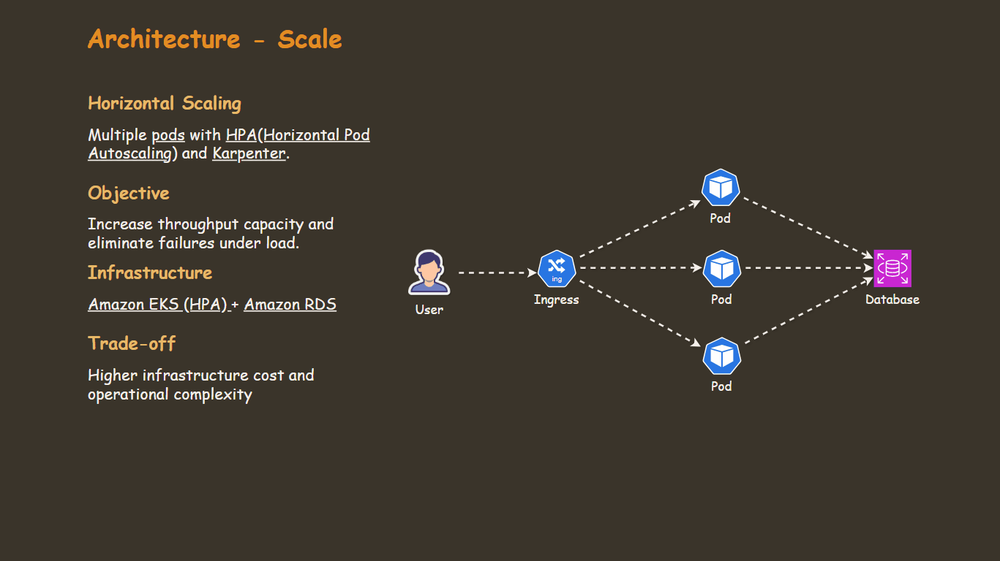
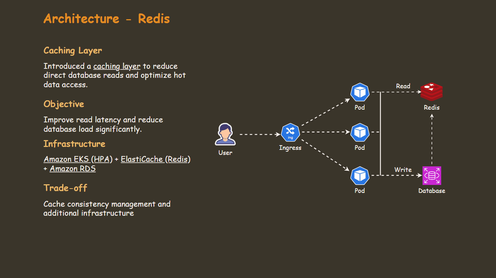
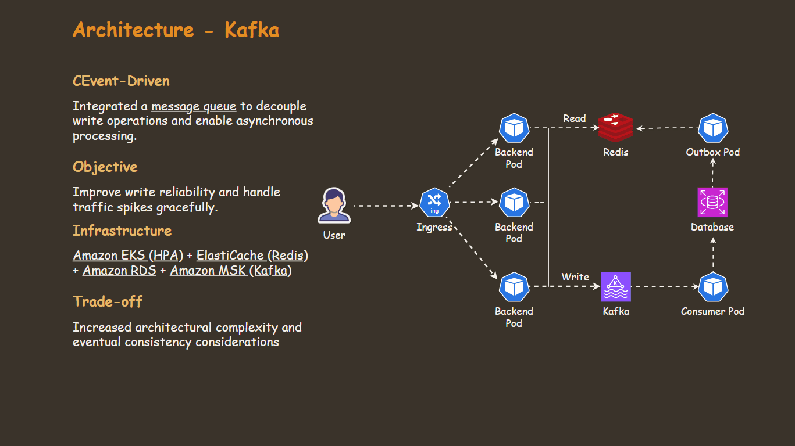

# Automated Architecture Benchmark (EKS)

**One Pipeline. Four Designs. Real Metrics.**

Welcome to visit my project website 👉 [website](https://eks-benchmark.arguswatcher.net/)

       

- [Automated Architecture Benchmark (EKS)](#automated-architecture-benchmark-eks)
  - [Motivation](#motivation)
  - [Results](#results)
  - [Four Designs](#four-designs)
  - [One Pipeline](#one-pipeline)
  - [Tech Stack](#tech-stack)

---

## Motivation

Architecture advice is often theoretical — "add caching," "use a message queue" — without data to back it up. This project answers a practical question:

**How much does each architectural decision actually move the needle under real load?**

Four designs. One automated pipeline. Identical traffic conditions. Real numbers.

---

## Results

Four architectures were tested in progression — Baseline, Auto-Scaling, Redis Caching, and Kafka — each addressing a limitation of the previous.

**Baseline → Kafka:**

- **+223% Throughput Improvement** — 310 → 1,000 RPS
- **-96.9% Latency Reduction** — 3,000ms → 92ms (p95)
- **~0% Request Failures** — nearly eliminated at 1,000 RPS
- **-75.1% Database CPU Reduction** — 42.1% → 10.5%

---

**Technical Comparison** - [Load Testing Snapshot](https://simonangelfong.grafana.net/dashboard/snapshot/le6w3uET15C2xp0PqoeB3j7VmSAwhik6?orgId=1&from=2026-03-11T17:25:00.000Z&to=2026-03-11T17:55:00.000Z&timezone=browser&refresh=5s&dtab=performance-testing)

| Architecture | Peak RPS | HTTP Failures | P95 Latency | Pod (Peak) | DB CPU |
| ------------ | -------- | ------------- | ----------- | ---------- | ------ |
| Baseline     | 310      | 29.2%         | 3,000ms     | 1          | 17.6%  |
| Scale        | 1,000    | ~0%           | 98ms        | 7          | 42.1%  |
| Redis        | 1,000    | ~0%           | 102ms       | 5          | 35.3%  |
| Kafka        | 1,000    | ~0%           | 92ms        | 3          | 10.5%  |

**Business Impact**

| Architecture | Business Continuity | DB Overload Risk | Operational Cost | Complexity |
| ------------ | ------------------- | ---------------- | ---------------- | ---------- |
| Baseline     | ❌ Low              | 🔴 High          | 🟢 Low           | 🟢 Low     |
| Scale        | 🟢 High             | 🟠 Medium–High   | 🟠 Medium        | 🟠 Medium  |
| Redis        | 🟢 High             | 🟡 Medium        | 🟠 Medium        | 🟠 Medium  |
| Kafka        | 🟢 Very High        | 🟢 Low           | 🔴 High          | 🔴 High    |

<!-- [Further analysis — load profile, metric behavior, and per-design breakdown](link) -->

---

## Four Designs

Each architecture addresses a limitation of the previous, tested under identical conditions.

<!-- [Architecture deep dives — design decisions, trade-offs, and technical challenges](link) -->

---

## One Pipeline

One automated workflow runs across all four designs — ensuring every benchmark is provisioned, tested, and torn down under identical conditions.

| Step | Action                   | Tool             |
| ---- | ------------------------ | ---------------- |
| 1    | Provision infrastructure | Terraform · Helm |
| 2    | Validate deployment      | Smoke test       |
| 3    | Load testing             | k6               |
| 4    | Tear down infrastructure | Terraform        |

<!-- [Pipeline design decisions — why GitHub Actions, why k6, and how state is managed across steps](link) -->

---

## Tech Stack

| Role               | Tools                                                |
| ------------------ | ---------------------------------------------------- |
| **Infrastructure** | AWS ECS · RDS · ElastiCache · MSK · Terraform · Helm |
| **CI/CD**          | GitHub Actions · Docker                              |
| **Load Testing**   | k6                                                   |
| **Observability**  | Grafana · CloudWatch                                 |
| **Backend**        | Python · FastAPI                                     |
