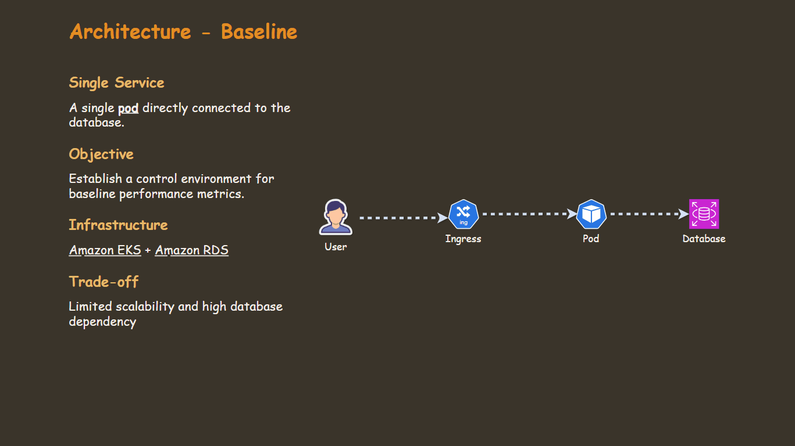
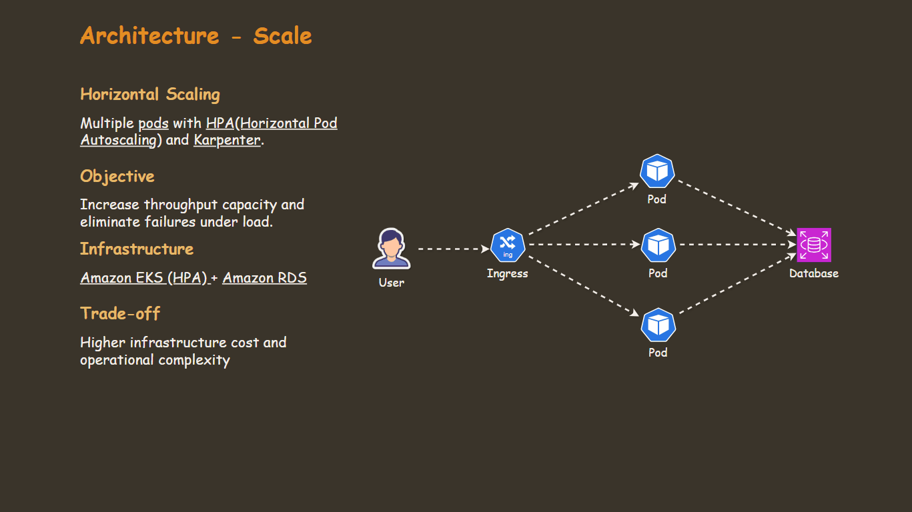
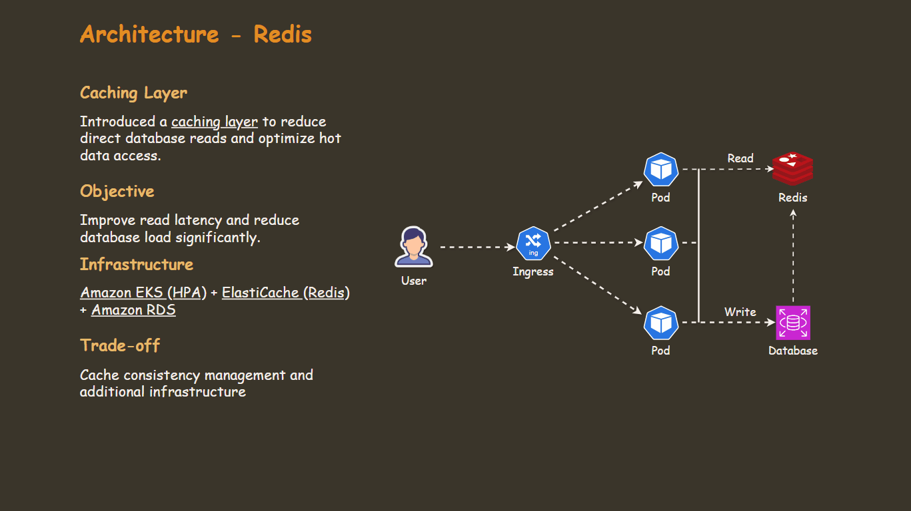
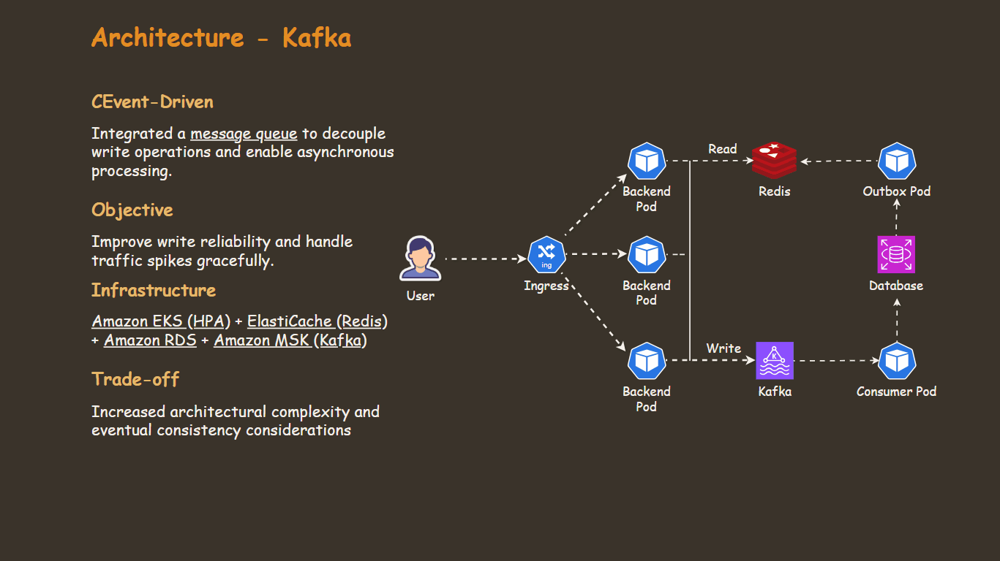

# Automated Architecture Benchmark (EKS)

**One Pipeline. Four Designs. Real Metrics.**

Welcome to visit my project website 👉 [website](https://eks-benchmark.arguswatcher.net/)

       

- [Automated Architecture Benchmark (EKS)](#automated-architecture-benchmark-eks)
  - [Motivation](#motivation)
  - [Results](#results)
  - [Four Designs](#four-designs)
  - [One Pipeline](#one-pipeline)
  - [Load Test](#load-test)
  - [Cost \& FinOps](#cost--finops)
  - [Debug Lessons](#debug-lessons)

---

## Motivation

Architecture advice is often theoretical — "add caching," "use a message queue" — without data to back it up. This project answers a practical question:

**How much does each architectural decision actually move the needle under real load?**

Four designs. One automated pipeline. Identical traffic conditions. Real numbers.

---

## Results

Four architectures were tested in progression — Baseline, Auto-Scaling, Redis Caching, and Kafka — each addressing a limitation of the previous.

**Baseline → Kafka:**

- **+223% Throughput Improvement** — 310 → 1,000 RPS
- **-96.9% Latency Reduction** — 3,000ms → 92ms (p95)
- **~0% Request Failures** — nearly eliminated at 1,000 RPS
- **-75.1% Database CPU Reduction** — 42.1% → 10.5%

---

**Technical Comparison** - [Load Testing Snapshot](https://simonangelfong.grafana.net/dashboard/snapshot/le6w3uET15C2xp0PqoeB3j7VmSAwhik6?orgId=1&from=2026-03-11T17:25:00.000Z&to=2026-03-11T17:55:00.000Z&timezone=browser&refresh=5s&dtab=performance-testing)

| Architecture | Peak RPS | HTTP Failures | P95 Latency | Pod (Peak) | Node (Peak) | DB CPU |
| ------------ | -------- | ------------- | ----------- | ---------- | ----------- | ------ |
| Baseline     | 310      | 29.2%         | 3,000ms     | 1          | 2           | 17.6%  |
| Scale        | 1,000    | ~0%           | 98ms        | 7          | 4           | 42.1%  |
| Redis        | 1,000    | ~0%           | 102ms       | 5          | 3           | 35.3%  |
| Kafka        | 1,000    | ~0%           | 92ms        | 3          | 3           | 10.5%  |

**Business Impact**

| Architecture | Business Continuity | DB Overload Risk | Operational Cost | Complexity |
| ------------ | ------------------- | ---------------- | ---------------- | ---------- |
| Baseline     | ❌ Low              | 🔴 High          | 🟢 Low           | 🟢 Low     |
| Scale        | 🟢 High             | 🟠 Medium–High   | 🔴 High          | 🟠 Medium  |
| Redis        | 🟢 High             | 🟡 Medium        | 🟠 Medium        | 🟠 Medium  |
| Kafka        | 🟢 Very High        | 🟢 Low           | 🔴 High          | 🔴 High    |

[Metric Analysis](./docs/metric/metric.md)

---

## Four Designs

Each architecture addresses a limitation of the previous, tested under identical conditions.

> Single pod connected to RDS

> Multiple pods with HPA for autoscaling

> Cache layer for read workload

> Event-driven layer for write workload

[EKS Challenges](./docs/eks/eks.md) | [ECS vs EKS](./docs/ecs_eks/ecs_eks.md)

---

## One Pipeline

One automated workflow runs across all four designs — ensuring every benchmark is provisioned, tested, and torn down under identical conditions.

| Step | Action                   | Tool             |
| ---- | ------------------------ | ---------------- |
| 1    | Provision infrastructure | Terraform · Helm |
| 2    | Validate deployment      | Smoke test       |
| 3    | Load testing             | k6               |
| 4    | Tear down infrastructure | Terraform        |

---

## Load Test

Each architecture was tested under identical conditions using a mixed read/write k6 script (`1:1` ratio to expose async writes), sourced from AWS Montreal.

| Phase       | Duration | Target RPS                                 |
| ----------- | -------- | ------------------------------------------ |
| Warm-up     | 1 min    | 0 → 50 RPS                                 |
| Ramp-up     | 20 min   | 50 → 500 RPS (read) + 50 → 500 RPS (write) |
| Peak / Soak | 5 min    | 1,000 RPS combined                         |
| Cool-down   | 1 min    | 500 → 0                                    |

**SLO thresholds applied during test:**

- HTTP failure rate < 1%
- p95 latency < 300ms

---

## Cost & FinOps

FinOps practices applied:

- HPA auto-scaling,
- automated tear-down after every run,
- and cost allocation tags per architecture.

Infrastructure exists only during the ~27-minute test window.

**Monthly equivalent (production estimate):**

| Architecture | Est. Monthly | Per Benchmark Run | Cost Driver                   |
| ------------ | ------------ | ----------------- | ----------------------------- |
| Baseline     | ~$246        | ~$0.15            | 2 × t3.medium nodes           |
| Scale        | ~$518        | ~$0.32            | +2 × c6i.xlarge at peak       |
| Redis        | ~$395        | ~$0.24            | +1 × c6i.xlarge + ElastiCache |
| Kafka        | ~$507        | ~$0.31            | +MSK 3-broker cluster         |

> - Kafka costs more to operate but eliminates DB overload risk, deferring vertical DB scaling.
> - Scale is costed at peak pod count (conservative).
> - Storage and ALB LCU charges excluded — see [FinOps & Cost](docs/cost.md) for full breakdown.

---

## Debug Lessons

**HPA silently inactive**

- **Issue:** HPA showed `unknown` CPU; pods never scaled
- **Root Cause:** metrics-server is not installed by default on EKS
- **Fix:** Explicitly provision metrics-server via Terraform add-ons

**Terraform/Helm boundary**

- **Issue:** `terraform apply` failed after a manual in-cluster change
- **Root Cause:** Terraform lost track of a resource modified outside its state
- **Fix:** Hard separation — Terraform owns AWS infra; Helm/kubectl owns all Kubernetes resources

**Cost Allocation Tags returned no results in Cost Explorer**

- **Issue**: `Cost Explorer` returned no results when filtering by tags, even though tags were defined in `Terraform`
- **Root Cause**: The `GitHub Actions` variable for the tag value was empty, resulting in a tag with a blank value in AWS
- **Fix**: Validate tag values (not just keys); add workflow input checks or a Terraform validation block to fail on empty required values
