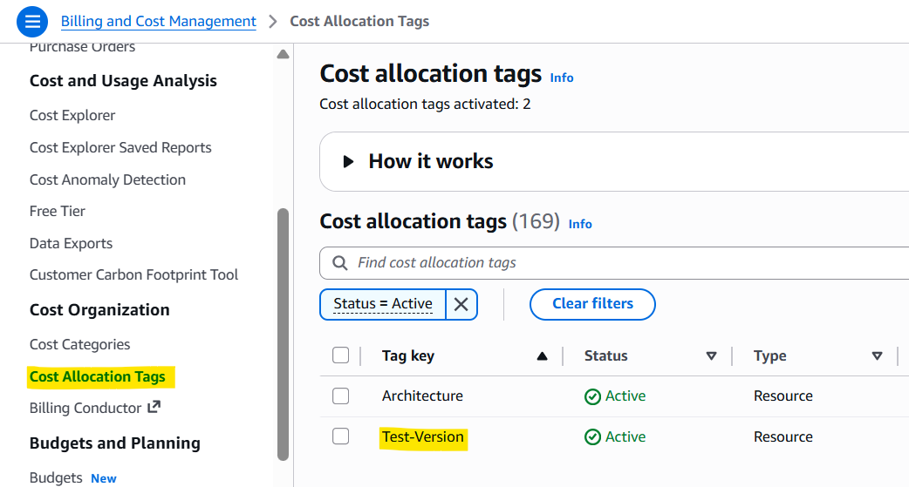

# FinOps & Cost Management

[Back](../README.md)

- [FinOps \& Cost Management](#finops--cost-management)
  - [Common FinOps Practices](#common-finops-practices)
  - [FinOps in This Project](#finops-in-this-project)
    - [What's Already in Place](#whats-already-in-place)
    - [Lesson Learned: Empty Tag Value from GitHub Actions Variable](#lesson-learned-empty-tag-value-from-github-actions-variable)
    - [Further FinOps Improvements for Production](#further-finops-improvements-for-production)
  - [Cost Estimation by Architecture](#cost-estimation-by-architecture)
    - [Baseline](#baseline)
    - [Scale](#scale)
    - [Redis](#redis)
    - [Kafka](#kafka)
    - [Per-Run Cost (Benchmark, ~27 min)](#per-run-cost-benchmark-27-min)
    - [AWS Pricing Calculator](#aws-pricing-calculator)

---

## Common FinOps Practices

| Practice                               | What It Means                                                                     | When to Apply                                                            |
| -------------------------------------- | --------------------------------------------------------------------------------- | ------------------------------------------------------------------------ |
| **Right-sizing**                       | Match resource size to actual demand — don't over-provision                       | Always; use metrics to validate                                          |
| **Reserved Instances / Savings Plans** | Commit to 1–3 years in exchange for 40–60% discount                               | Stable, predictable production baselines                                 |
| **Spot Instances**                     | Use spare AWS capacity at 60–90% discount; can be reclaimed with 2-min notice     | Stateless workloads: load test runners, batch jobs, non-critical workers |
| **Auto-scaling**                       | Pay only for capacity you need at any given moment                                | Variable traffic workloads                                               |
| **Auto tear-down**                     | Destroy infrastructure when not in use so you aren't billed for idle resources    | Benchmarks, ephemeral environments                                       |
| **Cost Allocation Tags**               | Tag every resource (`project`, `environment`, `owner`) to trace spend by workload | All environments; tag before provisioning                                |
| **Cost Explorer + Budgets**            | Visualize spend by service and set alert thresholds before a surprise bill        | Production; set alerts at sensible dollar thresholds                     |
| **Hidden cost awareness**              | NAT Gateway ($0.05/GB) and cross-AZ data transfer ($0.01/GB) accumulate silently  | Any architecture with private subnets or multi-AZ deployments            |

---

## FinOps in This Project

### What's Already in Place

**Horizontal Pod Autoscaler (HPA)**
Pods scale up under load and back down when traffic drops. The benchmark showed the Scale architecture peaking at 7 pods and returning to baseline — paying only for burst capacity when needed, not provisioning 7 pods statically.

**Automated tear-down in the pipeline**
Every benchmark run follows: provision → smoke test → load test → destroy. Infrastructure exists only for the ~27-minute test window. Leaving EKS nodes, RDS, and MSK running idle overnight would cost hundreds of dollars per month for nothing.

**Cost Allocation Tags**
Resources are tagged at provisioning time to enable per-architecture cost tracking in AWS Cost Explorer.

---

### Lesson Learned: Empty Tag Value from GitHub Actions Variable

`Cost Allocation Tags` were correctly defined in Terraform and tag values were passed in via GitHub Actions variables — but the variable was left empty during development and never populated before running the benchmark. The tag key existed in AWS; the value was blank, so Cost Explorer filters returned no results.

Takeaway: tags must be validated at the value level, not just the key level. When tag values come from CI/CD variables, add an explicit check (e.g., a workflow input validation step or a Terraform variable `validation` block) to fail fast if a required tag value is missing, rather than silently tagging resources with an empty string.

---

### Further FinOps Improvements for Production

Based on the benchmark metrics, the following improvements are relevant if any of these architectures were promoted to production:

**Reserved Instances / Savings Plans**
The benchmark shows each architecture's pod count at steady state: Baseline uses 1 pod, Redis uses 5, Kafka uses 3. A production deployment would have a predictable minimum node count — those baseline nodes are strong candidates for 1-year Reserved Instances (≈40% savings vs On-Demand).

**Spot Instances**
The k6 load generator itself is a stateless, interruptible workload — an ideal Spot candidate. Worker pods (if running Kafka consumers) could also tolerate interruption with proper consumer group rebalancing. DB nodes and Kafka brokers must remain On-Demand.

**AWS Cost Explorer + Budgets**
Set a monthly budget alert per environment. A reasonable starting threshold for a production EKS stack: alert at 80% of expected spend, hard-stop notification at 100%. This catches runaway scaling or forgotten resources before the invoice arrives.

**Mind the Hidden Costs**
Two costs that don't appear in instance pricing:

- **NAT Gateway**: private subnets use NAT Gateway to reach the internet (ECR image pulls, external APIs). Charged at $0.05/GB processed. High pod churn (many restarts pulling large images) amplifies this.
- **Cross-AZ data transfer**: EKS nodes and RDS in different Availability Zones pay $0.01/GB for traffic between them. With high RPS and a 1:1 read/write ratio (as in this benchmark), this adds up. Pin RDS and its primary consumer pods to the same AZ where possible.

---

## Cost Estimation by Architecture

Costs below are estimated for production-equivalent, always-on deployment (monthly). Each architecture adds components on top of the shared baseline.

> Reference: [AWS Pricing Calculator](https://calculator.aws/#/)

### Baseline

| Service               | Configuration              | Pricing Basis | Usage Monthly | Est. Monthly |
| --------------------- | -------------------------- | ------------- | ------------- | ------------ |
| EKS Control Plane     | 1 cluster                  | $0.10/hr flat | 730 hours     | ~$73         |
| Elastic Load Balancer | 1 ALB                      | $0.02475/hr   | 730 hours     | ~$18         |
| NAT Gateway           | 1 AZ                       | $0.05/hr      | 730 hours     | ~$36.50      |
| RDS PostgreSQL        | 1 db.t4g.medium, single-AZ | $0.07/hr      | 730 hours     | ~$51.1       |
| EC2 Managed Node      | 2 × t3.medium              | $0.0464/hr    | 730 hours     | ~$67.74      |
| **EC2 HPA Node**      | **0** × c6i.xlarge         | $0.186/hr     | 730 hours     | ~$0          |
| **Total**             |                            |               |               | **~$246**    |

---

### Scale

| Service               | Configuration              | Pricing Basis | Usage Monthly | Est. Monthly |
| --------------------- | -------------------------- | ------------- | ------------- | ------------ |
| EKS Control Plane     | 1 cluster                  | $0.10/hr flat | 730 hours     | ~$73         |
| Elastic Load Balancer | 1 ALB                      | $0.02475/hr   | 730 hours     | ~$18         |
| NAT Gateway           | 1 AZ                       | $0.05/hr      | 730 hours     | ~$36.50      |
| RDS PostgreSQL        | 1 db.t4g.medium, single-AZ | $0.07/hr      | 730 hours     | ~$51.1       |
| EC2 Managed Node      | 2 × t3.medium              | $0.0464/hr    | 730 hours     | ~$67.74      |
| EC2 HPA Node          | **2** × c6i.xlarge         | $0.186/hr     | 730 hours     | ~$271.56     |
| **Total**             |                            |               |               | **~$518**    |

---

### Redis

| Service               | Configuration              | Pricing Basis | Usage Monthly | Est. Monthly |
| --------------------- | -------------------------- | ------------- | ------------- | ------------ |
| EKS Control Plane     | 1 cluster                  | $0.10/hr flat | 730 hours     | ~$73         |
| Elastic Load Balancer | 1 ALB                      | $0.02475/hr   | 730 hours     | ~$18         |
| NAT Gateway           | 1 AZ                       | $0.05/hr      | 730 hours     | ~$36.50      |
| RDS PostgreSQL        | 1 db.t4g.medium, single-AZ | $0.07/hr      | 730 hours     | ~$51.1       |
| EC2 Managed Node      | 2 × t3.medium              | $0.0464/hr    | 730 hours     | ~$67.74      |
| EC2 HPA Node          | **1** × c6i.xlarge         | $0.186/hr     | 730 hours     | ~$135.78     |
| ElastiCache           | 1 × cache.t4g.micro        | $0.018/hr     | 730 hours     | ~$13.14      |
| **Total**             |                            |               |               | **~$395**    |

---

### Kafka

| Service               | Configuration              | Pricing Basis | Usage Monthly | Est. Monthly |
| --------------------- | -------------------------- | ------------- | ------------- | ------------ |
| EKS Control Plane     | 1 cluster                  | $0.10/hr flat | 730 hours     | ~$73         |
| Elastic Load Balancer | 1 ALB                      | $0.02475/hr   | 730 hours     | ~$18         |
| NAT Gateway           | 1 AZ                       | $0.05/hr      | 730 hours     | ~$36.50      |
| RDS PostgreSQL        | 1 db.t4g.medium, single-AZ | $0.07/hr      | 730 hours     | ~$51.1       |
| EC2 Managed Node      | 2 × t3.medium              | $0.0464/hr    | 730 hours     | ~$67.74      |
| EC2 HPA Node          | **1** × c6i.xlarge         | $0.186/hr     | 730 hours     | ~$135.78     |
| ElastiCache           | 1 × cache.t4g.micro        | $0.018/hr     | 730 hours     | ~$13.14      |
| MSK (Kafka)           | 3 × kafka.t3.small         | $0.0508/hr    | 730 hours     | ~$111.25     |
| **Total**             |                            |               |               | **~$507**    |

> - Scale architecture cost varies with traffic.
> - Redis reduces DB CPU load (delaying the need to upsize RDS).
> - Kafka costs the most to operate but eliminates DB overload risk — deferring the need for vertical DB scaling, which would itself add cost.

---

### Per-Run Cost (Benchmark, ~27 min)

| Architecture | Est. Per Run | Annualized (1 run/week) |
| ------------ | ------------ | ----------------------- |
| Baseline     | ~$0.15       | ~$8                     |
| Scale        | ~$0.32       | ~$17                    |
| Redis        | ~$0.24       | ~$13                    |
| Kafka        | ~$0.31       | ~$16                    |

> Per-run costs are prorated at 0.45 hrs (27 min) against each architecture's hourly rates. Annualized figures assume one benchmark run per week (52 runs/year). Actual costs depend on region, data transfer volume, and AWS pricing changes.

> **Estimation scope notes:**
>
> - **Storage costs omitted**: RDS gp3 storage (~20 GB minimum, ~$2.30/mo) and EC2 node root EBS volumes (~30 GB per node, ~$6/mo for 2 nodes) are not included. These are consistent across architectures and small relative to compute costs.
> - **ALB LCU charges omitted**: Tables price only the ALB base hourly rate ($0.02475/hr). At production-level RPS (1,000 req/s), LCU charges will exceed the base rate and vary with traffic; use the [AWS Pricing Calculator](https://calculator.aws/pricing/2/home) for a traffic-adjusted estimate.
> - **Scale HPA node count is peak-based**: The Scale architecture is costed at 2 HPA nodes (4 total), matching the benchmark peak. In practice, HPA scales nodes down during low-traffic periods, so real production cost would be lower on average. The estimate is intentionally conservative.

---

### AWS Pricing Calculator

To generate an accurate quote, use the [AWS Pricing Calculator](https://calculator.aws/) and add the following services:

- **Amazon EKS** — 1 cluster
- **Amazon EC2** — instance type and count per architecture
- **Amazon RDS for PostgreSQL** — instance class, storage GB, single or multi-AZ
- **Amazon ElastiCache for Redis** — instance class (Redis architecture only)
- **Amazon MSK** — broker type, count, storage (Kafka architecture only)
- **Elastic Load Balancing** — Application Load Balancer
- **AWS Data Transfer** — estimated GB/month outbound + cross-AZ
- **AWS NAT Gateway** — hours + GB processed
