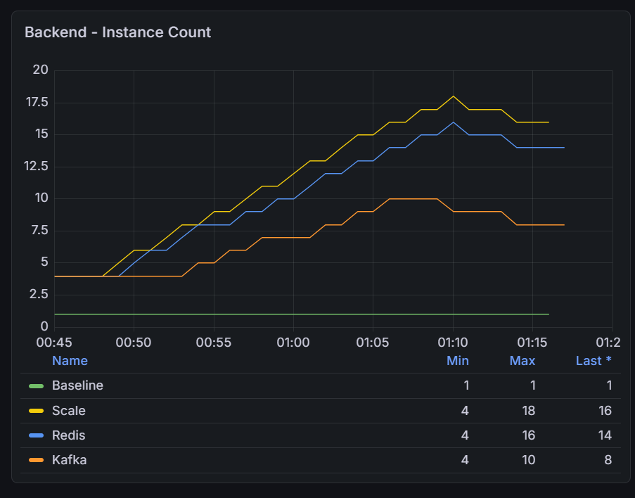
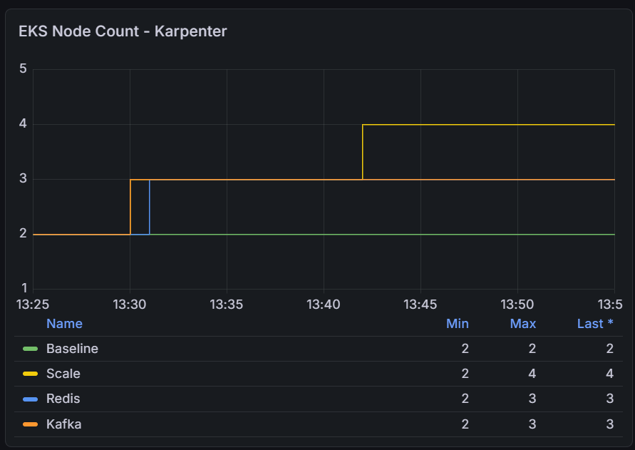
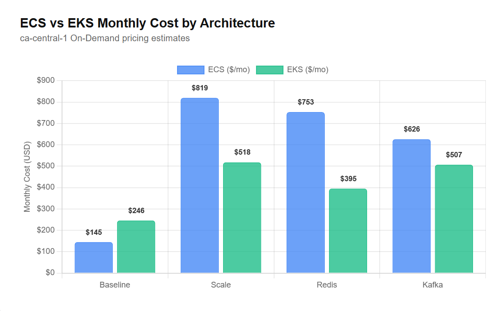

# ECS vs EKS Cost Comparison

[Back](../../README.md)

- [ECS vs EKS Cost Comparison](#ecs-vs-eks-cost-comparison)
  - [Cost Gap by Architecture](#cost-gap-by-architecture)
  - [FinOps Insight](#finops-insight)

---

## Cost Gap by Architecture

Estimates below use ca-central-1 On-Demand pricing.

| Architecture | ECS Monthly | EKS Monthly | Difference | Cheaper Platform |
| ------------ | ----------- | ----------- | ---------- | ---------------- |
| Baseline     | ~$145       | ~$246       | -$101      | **ECS**          |
| Scale        | ~$819       | ~$518       | +$301      | **EKS**          |
| Redis        | ~$753       | ~$395       | +$358      | **EKS**          |
| Kafka        | ~$626       | ~$507       | +$119      | **EKS**          |

---

**Baseline — ECS is cheaper by ~$83/mo**

- `EKS` carries a fixed ~$140.74/mo floor regardless of workload: $73/mo control plane + $67.74/mo for 2 always-on managed nodes. **Even if zero pods are running, those costs accrue.**
- `ECS Fargate` has **no control plane fee and no idle nodes** — billing starts and stops with each task. At 1 steady-state task, the EKS overhead dominates.

---

**Scale — EKS is cheaper by ~$334/mo**

- `ECS Fargate` billed **18** individual tasks × ~$0.054/hr × 730 hr = $713/mo compute alone.
- `EKS` billed 2 c6i.xlarge nodes × $0.186/hr × 730 hr = $271.56/mo regardless of how many of the 7 pods ran on them.
- **EC2 node packing** is the core mechanism: you buy shared capacity in blocks and amortize it across all pods, rather than metering every task individually.

- A secondary factor: ECS auto-scaled to 18 tasks to handle the same load that EKS handled with 7 pods. ECS tasks have a smaller per-task resource footprint, so more are spawned — amplifying the per-task billing penalty.

---

**Redis — EKS is cheaper by ~$393/mo (largest gap)**

- The `ElastiCache` cost ($12/mo) is **identical** on both platforms. Redis reduces backend pressure on both, but the per-platform savings are asymmetric:
  - on `ECS` it **eliminates 2 tasks** (~$79/mo saved);
  - on `EKS` it **removes one entire HPA node** (~$124/mo saved).
  - **Node packing** again amplifies the EKS advantage, making Redis's cost ROI higher on EKS.

---

**Kafka — EKS is cheaper by ~$155/mo (smallest gap)**

- `MSK` broker cost ($111/mo) is **shared equally**. Kafka's async write buffer cuts `ECS` task count **from 18 (Scale) to 10** — a $193/mo ECS saving that narrows the gap significantly.
- On `EKS`, removing Kafka overhead saves only ~$14/mo because EKS was already efficient via node packing. Kafka's primary value is **DB protection under burst load**, not cost reduction — the gap narrowing on ECS is a side effect of decoupling write pressure from task scaling.

---

- Cost Factors: `ECS Task` vs `EKS Node`

---

## FinOps Insight

**ECS Fargate wins at low scale; EKS wins when workload bursts.**

At **low scale**, `ECS Fargate`'s **pay-per-task model** carries no idle cost. The EKS ~$134/mo fixed floor (control plane + managed nodes) accrues regardless of workload. The Baseline architecture shows this clearly: ECS ~$145/mo vs. EKS ~$246/mo — a $101/mo penalty for infrastructure that sits largely idle.

Once workloads **burst**, EC2 node packing flips the equation. EKS buys shared capacity in blocks and amortizes it across all pods; ECS meters every task individually. Scale, Redis, and Kafka all confirm this:

- **Scale**: ECS scaled to 18 Fargate tasks (~$819/mo); EKS ran the same load on 2 nodes (~$518/mo) — **$301/mo cheaper**.
- **Redis**: Node packing amplifies Redis's ROI — removing one EKS node saves more than removing equivalent Fargate tasks (~$395/mo vs. ~$753/mo).
- **Kafka**: Even after Kafka cuts ECS task count from 18 to 10, EKS still wins (~$507/mo vs. ~$626/mo).

> **Break-even: ~3–4 steady-state tasks.** Below that, ECS Fargate wins; above it, EKS becomes progressively cheaper.

