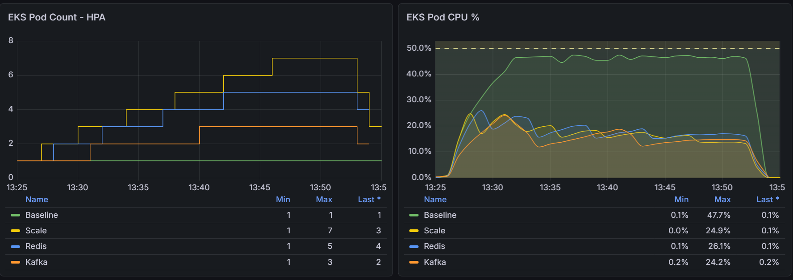
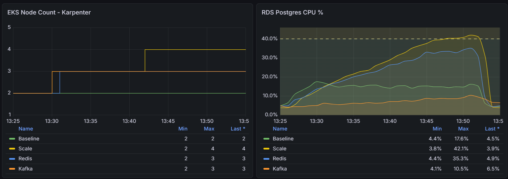

# Automated Architecture Benchmark (EKS) - Load Test Analysis

[Back](../../README.md)

- [Automated Architecture Benchmark (EKS) - Load Test Analysis](#automated-architecture-benchmark-eks---load-test-analysis)
  - [Overview](#overview)
  - [Key Results](#key-results)
  - [What the Metrics Reveal](#what-the-metrics-reveal)
    - [Throughput \& Scaling Behavior](#throughput--scaling-behavior)
    - [Backend Behavior](#backend-behavior)
    - [Database Pressure](#database-pressure)
  - [Behavior Differences](#behavior-differences)
  - [Key Takeaways](#key-takeaways)

---

## Overview

Under load, all optimized designs scaled successfully, but the **way they scaled reveals key architectural differences**:

- `Scale` relies on **horizontal scaling (HPA + Karpenter)** → higher infra usage + DB pressure
- **Redis** reduces **database dependency** → more stable system behavior
- **Kafka** smooths traffic via **asynchronous processing** → lowest system pressure

> **Conclusion:** Kubernetes scaling ensures availability, but **system design (cache + async)** determines efficiency and stability.

---

## Key Results

| Architecture | Peak RPS | HTTP Failures | P95 Latency | Pod (Peak) | DB CPU |
| ------------ | -------- | ------------- | ----------- | ---------- | ------ |
| Baseline     | 310      | 29.2%         | 3,000ms     | 1          | 17.6%  |
| Scale        | 1,000    | ~0%           | 98ms        | 7          | 42.1%  |
| Redis        | 1,000    | ~0%           | 102ms       | 5          | 35.3%  |
| Kafka        | 1,000    | ~0%           | 92ms        | 3          | 10.5%  |

---

## What the Metrics Reveal

### Throughput & Scaling Behavior

- `Baseline`
  - Fixed at **1 pod / 2 nodes**
  - No scaling → cannot respond to load dynamically

- `Scale`
  - Pods: **1 → 7**
  - Nodes: **2 → 4**
  - Reactive scaling via **HPA + Karpenter**

- `Redis`
  - Pods: **1 → 5**
  - Nodes: **2 → 3**
  - Require **less scaling to handle same load**

- `Kafka`
  - Pods: **1 → 3**
  - Nodes: **2 → 3**
  - Require **less scaling to handle same load**

> **Insight:** Better architecture reduces the need for aggressive autoscaling.

---

### Backend Behavior

- `Baseline`
  - Pod CPU ~**~47% (steady high)**
  - Indicates **constant pressure / near saturation**

- `Scale`/`Redis` / `Kafka`
  - CPU drops to **~20%**
  - Load distributed across many pods
  - Achieve stability **without excessive scaling**

> **Insight:**  
> Autoscaling enable lower CPU%

---

### Database Pressure

- `Scale`
  - Peaks at **~42%**
  - Strong upward trend → **DB becomes bottleneck**

- `Redis`
  - Peaks at **~35%**
  - Reduced load via caching

- `Kafka`
  - Stays low (**~10% max**)
  - Minimal DB dependency due to async processing

- `Baseline`
  - ~15% but misleading (low throughput)

> **Insight:**  
> Scaling shifts pressure downstream → DB becomes the limiting factor  
> Caching reduces pressure + Async architecture **eliminates spikes**

---

## Behavior Differences

- `Baseline`  
  No scaling → **system saturation** → unstable under load

- `Scale`  
  HPA + Karpenter scale aggressively → **handles load**  
  But shifts bottleneck → **database pressure increases**

- `Redis`
  Reduces redundant DB calls → **more stable scaling behavior**  
  Less infra needed compared to pure scaling

- `Kafka`  
  Decouples request and processing →
  - Smooth traffic
  - Reduce DB load
  - Minimize scaling needs

---

## Key Takeaways

- **Kubernetes scaling (HPA + Karpenter)** ensures availability under load
- **Scaling alone is not enough** → it shifts bottlenecks (DB pressure)
- **Caching (Redis)** improves efficiency and reduces backend load
- **Async architecture (Kafka)** provides the best balance:
  - Lowest DB pressure
  - Stable CPU usage
  - Minimal infrastructure scaling

> **Insight:**  
> In Kubernetes systems, **autoscaling solves symptoms (load)**,  
> but **architecture (cache + async) solves the root problem (system pressure)**.
